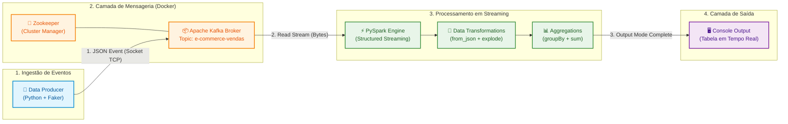
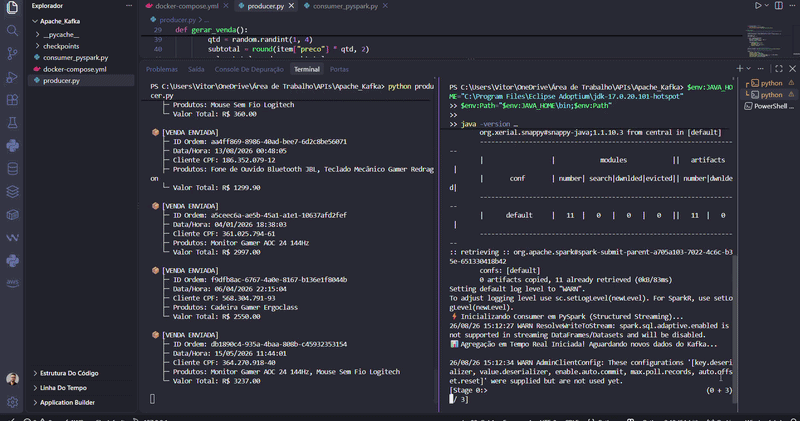
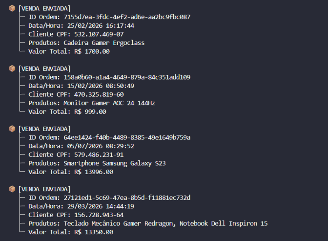
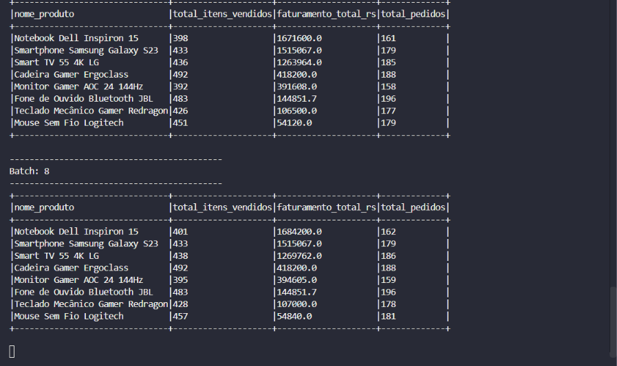

# 🛒 E-Commerce Real-Time Data Pipeline
### Ingestão, Processamento em Streaming e Agregação de Vendas com Apache Kafka, PySpark e Docker

<!-- BADGES DE TECNOLOGIAS -->
<p align="left">
  
  
  
  
  
  
  
  
  
</p>

Este projeto foi desenvolvido como um ambiente prático de treinamento e exibição de competências em **Engenharia de Dados**. O objetivo principal é simular o fluxo contínuo de dados (Streaming Architecture) de um e-commerce em grande escala (estilo Amazon / Mercado Livre), cobrindo desde a geração do evento de compra até a agregação contínua das métricas em tempo real.

---

## 🎯 Intuito e Objetivos do Projeto

- **Simulação de Alta Volumetria:** Simular transações reais de e-commerce com clientes fictícios, itens variados, preços unitários, subtotais e carimbos de data/hora.
- **Arquitetura Orientada a Eventos (EDA):** Demonstrar a ingestão distribuída de dados utilizando o **Apache Kafka**.
- **Processamento de Stream em Tempo Real:** Aplicar transformações, manipulação de vetores JSON (`explode`), parsing de schemas complexos e agregações incrementais utilizando o **PySpark Structured Streaming**.
- **Conteinerização e Ambiente Isolado:** Garantir a reprodutibilidade da infraestrutura de streaming através de **Docker** e **Docker Compose**.

---

## ⚡ Caso de Uso Real: Alta Disponibilidade na Black Friday

Em eventos de altíssimo tráfego como a **Black Friday**, arquiteturas de bancos de dados tradicionais sofrem com gargalos e risco de queda devido ao excesso de requisições síncronas.

Este projeto simula a solução ideal adotada pelos maiores e-commerces do mercado:

1. **Absorção de Picos de Tráfego:** O **Apache Kafka** recebe e enfileira os eventos de compra instantaneamente (suportando vazões de milhões de eventos/segundo), garantindo que o checkout da loja não caia.
2. **Processamento Assíncrono:** O **PySpark** consome e agrega as vendas continuamente em segundo plano, atualizando relatórios de faturamento, controle de estoque e detecção de fraudes em tempo real sem afetar a navegação do usuário.
3. **Escalabilidade Horizontal:** Tanto a camada de mensageria (brokers Kafka) quanto a de processamento (nós Spark) podem ser escaladas aditivamente conforme o volume de vendas aumenta durante a promoção.

---

## 🏗️ Arquitetura da Solução



---

## 📽️ Demonstração

o Gif demonstrativo do projeto em funcionamento, mostrando a execução sincronizada do Broker Kafka, do Producer gerando vendas aleatórias e do Consumer PySpark processando os aggregations ao vivo:



> *Nota: O arquivo do Gif `Funcionamento_ecommerce.gif` encontra-se anexo na raiz deste repositório.*


<br>
*Producer gerando os dados com o Faker, para mandar mensagens para o broker, e para ele separar para seu consumidor*


<br>
*Consumer Mostrando o processo finalizado*

---


## 🔍 Descrição Detalhada dos Componentes

### 1. Infraestrutura Docker & Kafka (`docker-compose.yml`)
- **Zookeeper:** Responsável pelo gerenciamento do cluster e coordenação dos nós do Kafka.
- **Kafka Broker:** Servidor de mensageria configurado na porta `9092` (acesso local) com a criação do tópico dedicado `e-commerce-vendas`.

### 2. Produtor de Dados (`producer.py`)
- **Faker (pt_BR):** Gera dados realistas como CPF (`documento_cliente`), IDs únicos no formato UUID4 (`id_ordem`) e carimbos de data/hora (`DD/MM/YYYY HH:MM:SS`).
- **Catálogo Dinâmico:** Seleciona aleatoriamente produtos fictícios (smartphones, notebooks, monitores, etc.), sorteia quantidades (1 a 4 itens) e calcula o subtotal e o valor total da ordem.
- **KafkaProducer:** Serializa o dicionário Python em JSON comprimido via codificação `UTF-8` e envia continuamente para o broker.

### 3. Processador de Streaming (`consumer_pyspark.py`)
- **Validação de Runtime Java:** Garante que o ambiente esteja sendo executado com a versão Java compatível com o PySpark 3.5.1 (Java 17 ou inferior).
- **Conector Kafka (`spark-sql-kafka-0-10`):** Estabelece a leitura contínua (`readStream`) a partir do deslocamento inicial configurado (`earliest`/`latest`).
- **Parsing de Schema Explícito:** Aplica `StructType` e `ArrayType` para converter a coluna textual `json_payload` em estruturas fortemente tipadas.
- **Transformação `explode()`:** Achata o array de produtos contido em cada ordem de compra em linhas individuais para possibilitar a granularidade do cálculo por produto.
- **Agregação e Janelamento:** Realiza o agrupamento `groupBy("nome_produto")`, calculando a soma do faturamento (`faturamento_total_rs`), total de unidades vendidas (`total_itens_vendidos`) e total de ordens associadas.
- **Checkpointing:** Utiliza diretórios de checkpoint para garantir resiliência e recuperação em caso de falhas de processamento.

---

## 🚀 Como Executar o Projeto

### Pré-requisitos
- Docker & Docker Compose instalados.
- Python 3.10+
- Java JDK 11 ou 17 instalado e configurado no caminho do sistema (`JAVA_HOME`).

### 1. Subir o ambiente Kafka via Docker
```bash
docker-compose up -d
```
### 2. Instalar as dependências do Python

```
pip install kafka-python faker pyspark==3.5.1
```

3. Iniciar o Producer (Simulador de Vendas)
Em um terminal dedicado, ou dividido igual ao GIF:
```
python producer.py
```

4. Iniciar o Consumer (PySpark)
Em outro terminal, execute:
```
python consumer_pyspark.py
```
ou para versão de java especifica do projeto:
```
$env:JAVA_HOME="C:\Program Files\Eclipse Adoptium\jdk-17.0.20.101-hotspot"
$env:Path="$env:JAVA_HOME\bin;$env:Path"

java -version
python consumer_pyspark.py
```
---


📊 Exemplo da Saída do Processamento
A cada lote de mensagens processado pelo Spark, a tabela de agregação atualizada é impressa diretamente no terminal:


<br>
*O Consumer extraído os dados via produção, para fazer as métricas*

🛠️ Tecnologias Utilizadas
Linguagem: Python 3.10+

Processamento Distribuído: Apache Spark / PySpark Structured Streaming (v3.5.1)
(Java é o motor por trás do Spark e do Kafka que faz todo o processamento pesado acontecer)

Mensageria: Apache Kafka & Zookeeper

Gerador de Dados: Faker

Conteinerização: Docker & Docker Compose


<ElicitationsGroup message="Precisa de mais algum detalhe ou instrução para preparar o repositório?">
  <Elicitation label="Como subir este repositório no GitHub passo a passo" query="Como faço para subir o meu código e o arquivo README.md para o GitHub via linha de comando?"/>
  <Elicitation label="Criar um arquivo docker-compose.yml padrão para o Kafka" query="Poderia me fornecer o código completo de um docker-compose.yml otimizado para Zookeeper e Kafka?"/>
</ElicitationsGroup>
